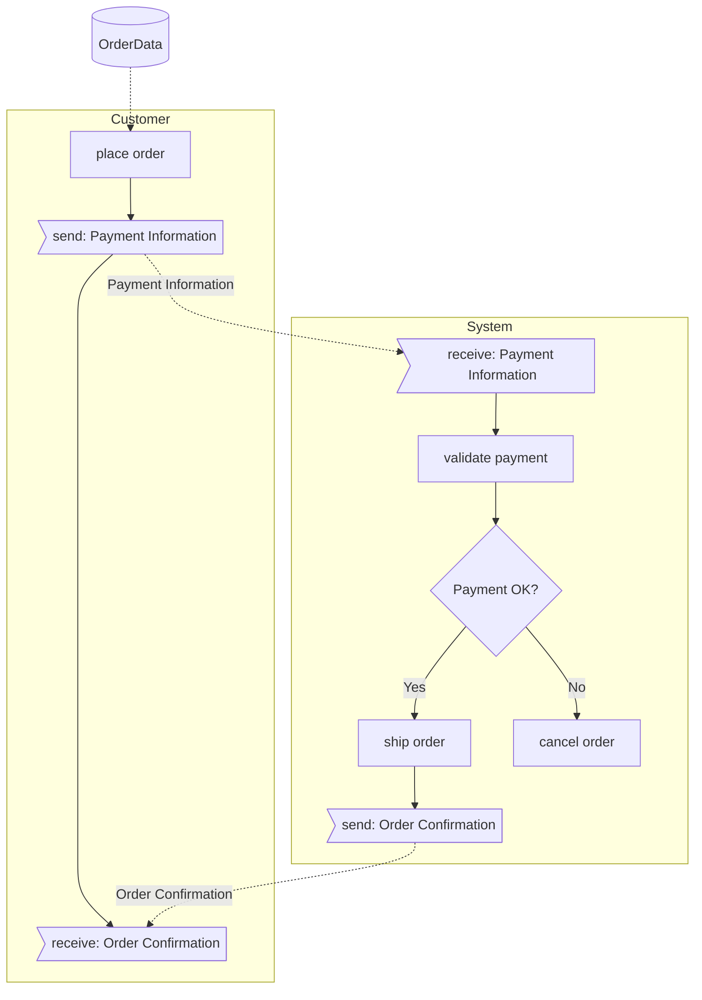
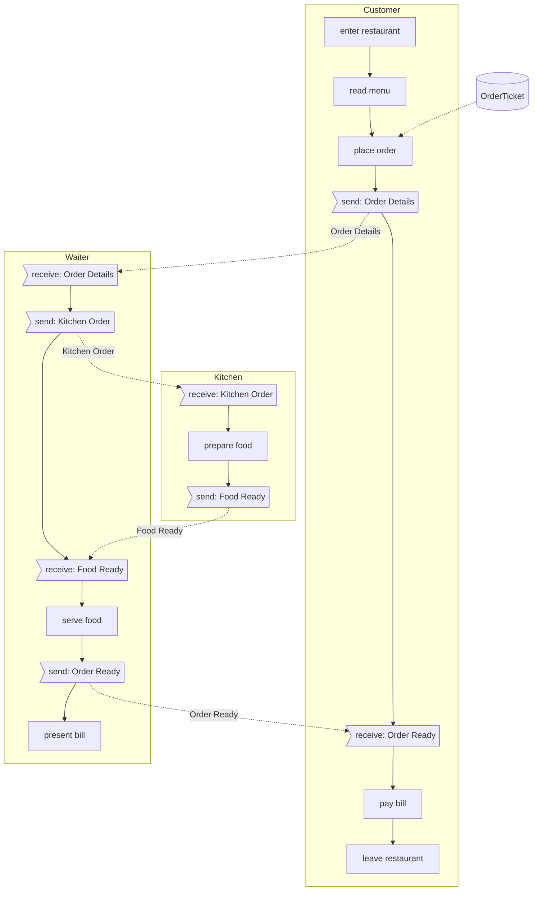
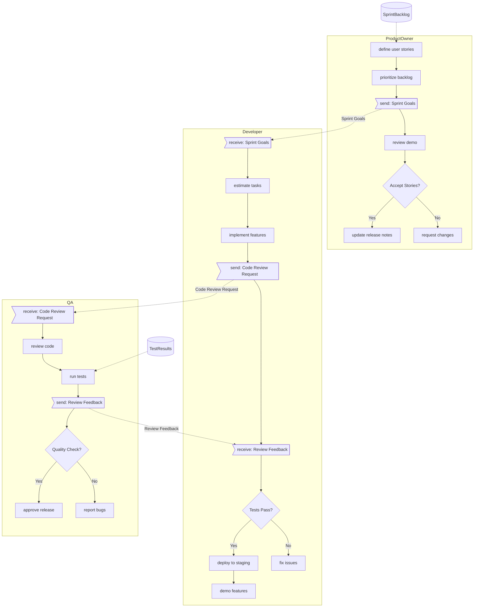
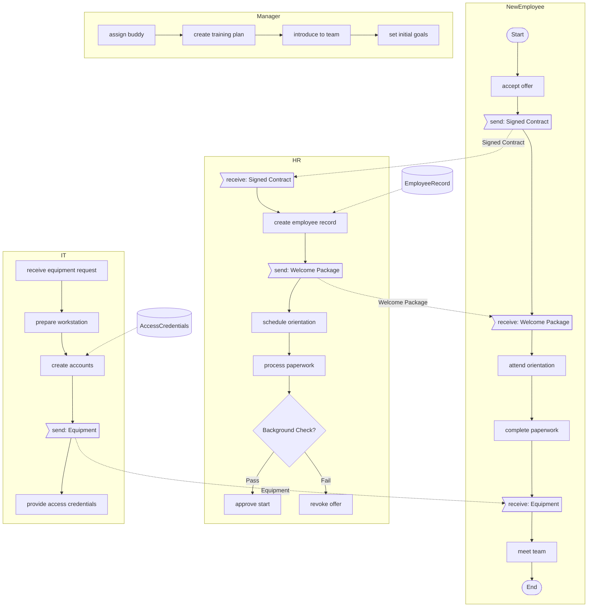
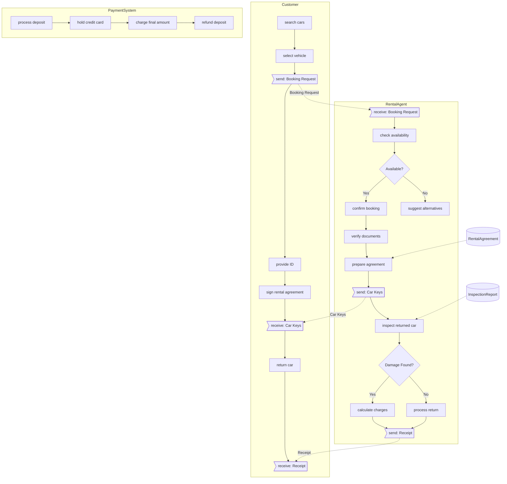
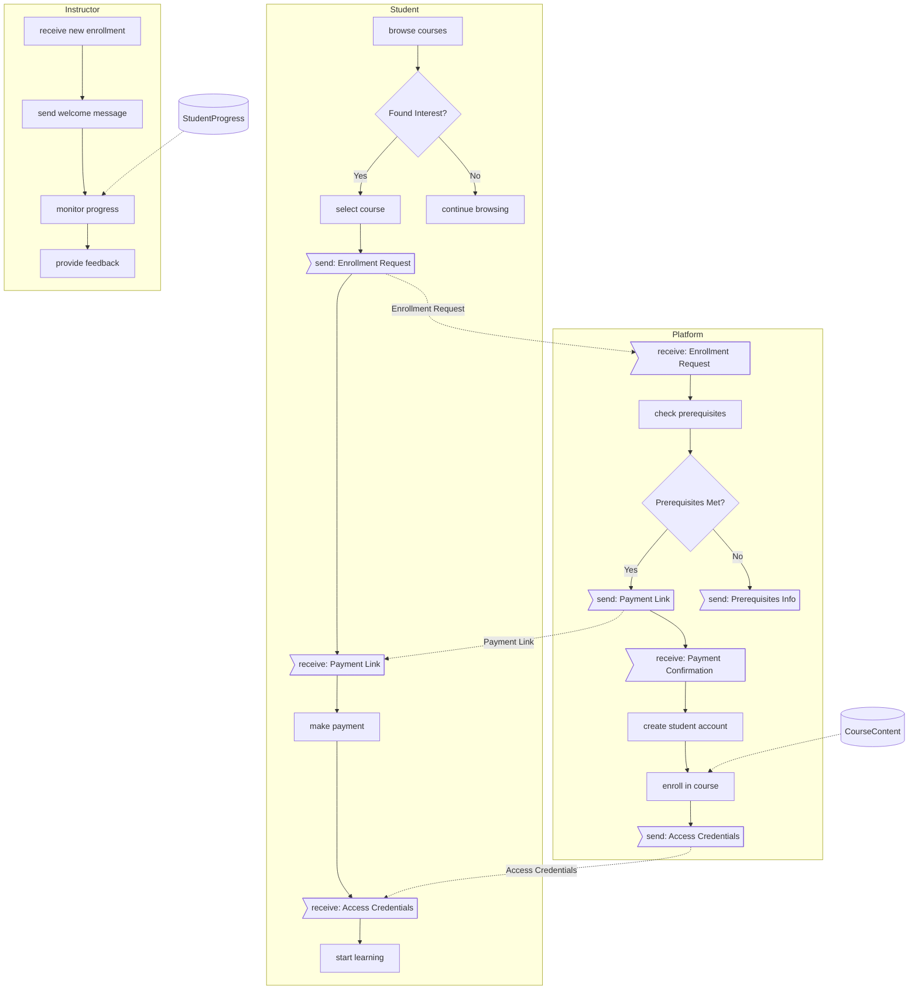

# 📖 BPMN-lite DSL Specification

### Purpose

A minimal, intuitive domain-specific language for describing business process diagrams that can be rendered to both BPMN and Mermaid formats. The DSL prioritizes simplicity, readability, and expressiveness while minimizing syntax overhead.

### Core Design Principles

- Prefix-based syntax for clear visual distinction
- No brackets, quotes or closing tags needed (except for parallel flows and decision labels)
- Intuitive character choices for each element type
- Support for all essential BPMN elements
- Easy to write by hand and parse programmatically
- Whitespace-insensitive parsing (indentation for readability only)

### Prefix Symbol Reference

|Symbol|BPMN Element|Rationale|
|---|---|---|
|`:`|Process definition|Resembles a label marker, common in many domain languages|
|`@`|Lane/Pool|Represents "at" or "location", indicating where tasks occur|
|`->`|Flow connector|Universal directional arrow symbol|
|`<-`|Incoming flow connector|Reverse arrow showing connection from another task|
|`?`|XOR Gateway|Question mark naturally represents decision points|
|`+`|Positive/Named branch|Plus sign represents an explicit path in a gateway|
|`-`|Negative/Else branch|Minus sign represents fallback or else path|
|`{`|Start parallel/inclusive|Opening bracket suggests the beginning of a grouped section|
|`}`|End parallel/inclusive|Closing bracket naturally pairs with opening bracket|
|`=`|Parallel (AND) branch|Equal signs visually represent parallel tracks|
|`~`|Inclusive (OR) branch|Tilde suggests "approximately" or optionality|
|`[` `]`|Subprocess|Square brackets suggest a contained/nested process|
|`!`|Events|Exclamation mark draws attention to significant events|
|`^`|Message flow|Caret suggests sending/transmitting information|
|`#`|Data object|Resembles a document or container|
|`$`|Data store|Dollar sign represents persistent/valuable data|
|`"`|Diagram comment|Quotation mark is intuitive for visible commentary|
|`//`|Technical comment|Standard comment syntax in many programming languages|
|`---`|Lane boundary marker|Prevents automatic flow connection between lanes|

### DSL Quick Reference

#### Core Elements

| Syntax | Element | Description |
|--------|---------|-------------|
| `:Process Name` | Process | Define the overall process |
| `@Department` | Lane/Pool | Group related activities |
| `  task name` | Task | Any indented line is a task |
| `?Decision` | Gateway | Decision point (XOR) |
| `+choice` | Positive Branch | Yes/True path |
| `-choice` | Negative Branch | No/False path |
| `!Start` / `!End` | Events | Process start/end points |

#### Communication

| Syntax | Element | Description |
|--------|---------|-------------|
| `send: Message` | Send Task | Send a message |
| `receive: Message` | Receive Task | Wait for a message |
| `^Flow @A.task -> @B.task` | Message Flow | Explicit connection |

#### Data & Annotations

| Syntax | Element | Description |
|--------|---------|-------------|
| `#DataObject task` | Data | Attach data to tasks |
| `"Comment text` | Annotation | Visible comment |
| `// Hidden comment` | Comment | Not shown in diagram |

### Advanced Features

```
# Custom gateway labels
?Payment Method
  +|Credit Card| process card payment
  +|PayPal| process PayPal
  -|Cancel| cancel transaction

# Direct connections
task A -> task C  # Skip task B
task D <- task B  # Reverse arrow
```

## Syntax Reference

### Process Definition

```
:Process Name
```

### Lanes/Pools

```
@Lane Name
  task 1
  task 2
```

### Tasks

- Simple text lines after lane definition
- Tasks are automatically connected in sequence within the same lane
- Explicit connections can be made using `->` or `<-`:
    
    ```
    task A -> task C  // Creates direct flow from A to C
    task C <- task A  // Alternate syntax, same effect as above
    task A -> task C -> task E  // Creates chained connections
    ```

### Task Name Resolution

For task references without lane prefixes, the parser searches in this order:

1. **Current lane first** - searches for the task name in the current lane
2. **Previous lanes (bottom-up)** - searches lanes defined before the current lane, from most recent to oldest
3. **Forward search (top-down)** - searches from current position to end of process definition

Examples:

```
@Customer
  place order -> validate order  // Forward reference, found in Validation lane
  receive confirmation

@Validation  
  validate order                 // Referenced from Customer lane
  check inventory -> update stock // Forward reference to Warehouse lane

@Warehouse
  update stock                   // Referenced from Validation lane
  prepare shipment -> place order // Backward reference to Customer lane
```

### Lane Boundary Marker

Use `---` to prevent automatic flow connection between lanes:

```
@Lane1
  task A
  task B
  ---  // Prevents auto-connection to next lane

@Lane2  
  task C  // Not connected to task B due to boundary marker
  task D
```

### Gateways

#### XOR Gateways (Exclusive Decision)

XOR gateways can be defined in two ways:

**Inline form (simple decisions):**

```
?Decision Point
  +yes path
  -no path
next task  // First + path connects here
```

**Block form (consistent with other gateways):**

```
{?Decision Point
  +yes path
  -no path
}Decision Complete
next task  // First + path connects here
```

For multi-branch decisions:

```
{?Payment Method
  +Credit Card
  +PayPal
  +Bank Transfer
  -Cancel
}Payment Method Selected
process payment  // Only first + path (Credit Card) connects here
```

#### XOR Gateway Connection Rules

1. **Default Behavior**:
    - First `+` path: Automatically connects to the next task after the decision
    - Additional `+` paths: Must be explicitly connected
    - `-` path: Must be explicitly connected
2. **Explicit Connections**:
    
    ```
    {?Payment Method
      +Credit Card  // Auto-connects to "process payment"
      +PayPal -> special PayPal process
      +Bank Transfer -> bank verification
      -Cancel -> cleanup process
    }Payment Method Selected
    process payment  // Only receives flow from Credit Card
    ```

#### Parallel Gateways (AND)

Parallel gateways use `{` prefix for splits and `}` suffix for joins. Branches use `=` prefix:

```
{Parallel Process
  =path 1
  =path 2
  =path 3
}Join Gate
next task  // All = paths connect here
```

#### Inclusive Gateways (OR)

Similar to parallel gateways, but branches use `~` prefix:

```
{Optional Steps
  ~option 1
  ~option 2
  ~option 3
}Choices Complete
next task  // All ~ paths connect here
```

#### Gateway Connection Summary

|Gateway Type|Inline|Block Form|First Branch|Other Branches|
|---|---|---|---|---|
|XOR|`?`|`{?` `}`|Auto-connects|Explicit only|
|AND|N/A|`{=` `}`|Auto-connects|Auto-connects|
|OR|N/A|`{~` `}`|Auto-connects|Auto-connects|

#### Decision Label Overrides

Use quotes to override default decision labels:

```
{?International shipping
  + "yes" prepare customs documents
  - "no" use domestic shipping
}Shipping Decision Complete

{?Payment Method
  + "Credit" process credit card
  + "Debit" process debit card  
  - "Cash" handle cash payment
}Payment Method Selected
```

#### Mixed Gateway Types

Mixed prefixes can be used within a single block. The parser will automatically generate the appropriate nested gateway structure:

```
{Payment Processing
  =Record Transaction       // AND branch
  =Update Inventory        // AND branch
  +Credit Card Processing  // XOR option
  +Bank Transfer          // XOR option
  -Manual Payment         // XOR fallback
  ~Send Receipt          // OR branch
  ~Send Notification     // OR branch
}Payment Complete
```

### Cross-Lane References

Tasks in other lanes can be referenced using the lane name:

```
@Lane 01
  task A
  task B -> @Lane 02.specific task

@Lane 02
  task X
  specific task
  task Y <- @Lane 01.task A
```

### Subprocesses

Collapsed form:

```
[subprocess name]
```

Expanded form (shows internal structure):

```
[subprocess name]+
```

Subprocess definition:

```
:Main Process
@Lane 1
  task 1
  [handle payment]
  task 3

:handle payment
@Payment Lane
  validate card
  process transaction
```

### Events

All events use the `!` prefix followed by the event type:

#### Start and End Events

```
!start
!start Begin process
!end
!end Complete process
```

Default behavior:

- If not specified, `!start` is added to the first task in the first lane
- If not specified, `!end` is added after the last task in the last lane
- Can be explicitly placed anywhere to override defaults

#### Intermediate Events

```
!message Receive confirmation
!timer Wait 24 hours
!error Handle timeout
!signal Process triggered
!send Order Request
!receive Order Confirmation
```

### Message Flows

#### Position-Based (Implicit)

```
@Customer
  place order
  ^Order Confirmation
  receive confirmation
```

#### Direction-Based (Explicit)

```
^Order Details -> @Sales.process order
^Payment Confirmation <- @Finance.payment processed
```

#### Automatic Connection

Tasks with `!send` and `!receive` events are automatically connected:

```
@Customer
  !send Order Request

@System
  !receive Order Request  // Auto-connected from Customer
```

### Data Objects and Stores

#### Data Objects

```
#OrderData
#CustomerInfo process order
#Invoice generate invoice
```

#### Data Stores (Persistent)

```
$Customer Database
$Order History -> retrieve past orders
```

#### Position-Based Data Flow

```
validate order
#Order Details
process payment  // Connected via Order Details
```

### Comments

#### Visible Comments (appear in diagram)

```
"This comment will appear in the diagram
"Multi-line comments<br/>use HTML line breaks
```

#### Technical Comments (hidden)

```
// This comment won't appear in the diagram
task A // This is also hidden
```

## Parsing Rules

1. First non-whitespace character determines line type
2. Whitespace is ignored for parsing - indentation is purely for readability
3. Standard pretty-printing uses:
    - Process and lane declarations: column 0
    - Tasks and gateways: indent 2 spaces
    - Gateway branches: indent 4 spaces (additional 2)
    - Nested elements: add 2 spaces per level
4. Empty lines are ignored
5. Tasks in sequence are automatically connected unless separated by `---`
6. Task name resolution follows: current lane → previous lanes (bottom-up) → forward search (top-down)
7. Cross-lane references use `@LaneName.taskName` syntax for explicit lane targeting
8. Gateway branches follow connection rules based on gateway type
9. Mixed gateway types within a block are automatically structured

## Complete Example

```
:Order Fulfillment Process

@Customer
  browse products
  add to cart
  {?Ready to purchase
    + "Yes" proceed to checkout
    - "No" save cart -> !end Exit
  }Purchase Decision Complete
  checkout
  [customer authentication]
  provide shipping address
  {?Express delivery
    + "Express" select express shipping
    - "Standard" select standard shipping
  }Delivery Option Selected
  complete payment
  !send Order Submission
  !timer Wait for confirmation
  !receive Order Confirmation
  "Customer receives confirmation<br/>and tracking information"
  ---

@OrderSystem  
  !receive Order Submission
  #OrderData validate order
  validate order
  process payment
  {?Payment successful
    + "Approved" update order status
    + "Partial" request additional payment -> complete payment
    - "Declined" cancel order -> !send Order Cancelled
  }Payment Processing Complete
  {Process Order
    =update inventory
    =generate invoice
    =prepare shipment
  }Order Processing Complete
  !send Order Confirmation
  $Order Database
  ---

@Warehouse
  !receive Shipment Request
  pick items
  pack order
  {Shipping Options
    ~add insurance
    ~add tracking
  }Shipping Options Complete
  ship package
  ^Shipment Complete -> update order status

:customer authentication
@Security
  {?Have account
    + "Yes" login
    - "No" register
  }Authentication Method Selected
  verify identity
  
:prepare shipment  
@Shipping
  calculate costs
  select carrier
  generate label
```

## Best Practices

1. Use clear, descriptive task names
2. Keep lane names concise but meaningful
3. Use explicit connections for clarity in complex flows
4. Group related tasks within lanes
5. Use comments to explain business rules
6. Define subprocesses for reusable components
7. Use `---` to clearly separate independent process sections
8. Rely on automatic task name resolution for cleaner syntax
9. Use explicit lane references (`@LaneName.taskName`) only when automatic resolution is ambiguous
10. Use block form for gateways when consistency is important or when dealing with complex multi-branch decisions
11. Use inline form for simple binary XOR decisions when brevity is preferred

## Examples

### Simple Order Process

This basic example shows how intuitive it is to describe a business process:

```
:Order Process

@Customer
  place order
  send: Payment Information
  receive: Order Confirmation

@System
  receive: Payment Information
  validate payment
  ?Payment OK
    +ship order
    -cancel order
  send: Order Confirmation

#OrderData place order
```

**Renders as:**



### Restaurant Order Process

A simple restaurant ordering workflow:

**BPL Code:**
```
:Restaurant Order Process

@Customer
  enter restaurant
  read menu
  place order
  send: Order Details
  receive: Order Ready
  pay bill
  leave restaurant

@Waiter
  receive: Order Details
  send: Kitchen Order
  receive: Food Ready
  serve food
  send: Order Ready
  present bill

@Kitchen
  receive: Kitchen Order
  prepare food
  send: Food Ready

#OrderTicket place order
```

**Renders as Mermaid:**


### Software Development Sprint

A typical agile development sprint workflow:

**BPL Code:**
```
:Sprint Development Process

@ProductOwner
  define user stories
  prioritize backlog
  send: Sprint Goals
  review demo
  ?Accept Stories
    +update release notes
    -request changes

@Developer
  receive: Sprint Goals
  estimate tasks
  implement features
  send: Code Review Request
  receive: Review Feedback
  ?Tests Pass
    +deploy to staging
    -fix issues
  demo features

@QA
  receive: Code Review Request
  review code
  run tests
  send: Review Feedback
  ?Quality Check
    +approve release
    -report bugs

#SprintBacklog define user stories
#TestResults run tests
```

**Renders as Mermaid:**


### Complex E-Commerce Order Fulfillment

A more complex example showing multiple departments, parallel processes, and decision points:

```
:E-Commerce Order Fulfillment

@Customer
  !Start
  browse products
  add to cart
  checkout
  send: Payment Details
  send: Shipping Address
  receive: Order Confirmation
  receive: Tracking Number
  receive: Package
  rate experience
  !End

@OrderManagement
  receive: Payment Details
  receive: Shipping Address
  validate order
  ?Fraud Check
    +|Pass| process payment
    -|Fail| cancel order
  ?Payment Success
    +create fulfillment request
    -notify payment failure
  send: Order Confirmation

@Inventory
  check stock availability
  ?In Stock
    +|Available| reserve items
    +|Partial| split order
    -|Out of Stock| backorder items
  update inventory
  pack items

@Shipping
  receive fulfillment request
  ?Shipping Method
    +|Express| priority handling
    +|Standard| regular handling
    -|International| customs processing
  generate shipping label
  send: Tracking Number
  dispatch courier

@CustomerService
  monitor order status
  ?Customer Issue
    +resolve complaint
    -escalate to manager
  process returns
  send feedback survey

#OrderData checkout
#PaymentData process payment
#ShippingLabel generate shipping label
```

### Employee Onboarding Process

A complete HR onboarding workflow:

**BPL Code:**
```
:Employee Onboarding

@NewEmployee
  !Start
  accept offer
  send: Signed Contract
  receive: Welcome Package
  attend orientation
  complete paperwork
  receive: Equipment
  meet team
  !End

@HR
  receive: Signed Contract
  create employee record
  send: Welcome Package
  schedule orientation
  process paperwork
  ?Background Check
    +|Pass| approve start
    -|Fail| revoke offer

@IT
  receive equipment request
  prepare workstation
  create accounts
  send: Equipment
  provide access credentials

@Manager
  assign buddy
  create training plan
  introduce to team
  set initial goals

#EmployeeRecord create employee record
#AccessCredentials create accounts
```

**Renders as Mermaid:**


### Bank ATM Transaction

A simple ATM withdrawal process:

**BPL Code:**
```
:ATM Cash Withdrawal

@Customer
  insert card
  enter PIN
  ?PIN Valid
    +select withdrawal
    +enter amount
    +receive: Cash
    +take card
    -receive: Card
  !End

@ATM
  read card
  verify PIN
  ?Account Valid
    +display options
    +?Sufficient Funds
      +dispense cash
      +send: Cash
      -show insufficient funds
    -return card
  send: Card
  
@BankSystem
  validate account
  check balance
  debit account
  log transaction

#TransactionLog log transaction
```

**Renders as Mermaid:**


```mermaid
flowchart TD
  subgraph customer[Customer]
    customer_insert_card[insert card]
    customer_enter_pin[enter PIN]
    customer_pin_valid{PIN Valid?}
    customer_select_withdrawal[select withdrawal]
    customer_enter_amount[enter amount]
    customer_receive_cash>receive: Cash]
    customer_take_card[take card]
    customer_receive_card>receive: Card]
    customer_end([End])
  end
  
  subgraph atm[ATM]
    atm_read_card[read card]
    atm_verify_pin[verify PIN]
    atm_account_valid{Account Valid?}
    atm_display_options[display options]
    atm_sufficient_funds{Sufficient Funds?}
    atm_dispense_cash[dispense cash]
    atm_send_cash>send: Cash]
    atm_show_insufficient_funds[show insufficient funds]
    atm_return_card[return card]
    atm_send_card>send: Card]
  end
  
  subgraph banksystem[BankSystem]
    banksystem_validate_account[validate account]
    banksystem_check_balance[check balance]
    banksystem_debit_account[debit account]
    banksystem_log_transaction[log transaction]
  end
  
  data_transactionlog[(TransactionLog)]
  
  customer_insert_card --> customer_enter_pin
  customer_enter_pin --> customer_pin_valid
  customer_pin_valid -->|Yes| customer_select_withdrawal
  customer_select_withdrawal --> customer_enter_amount
  customer_enter_amount --> customer_receive_cash
  customer_receive_cash --> customer_take_card
  customer_take_card --> customer_end
  customer_pin_valid -->|No| customer_receive_card
  customer_receive_card --> customer_end
  
  atm_read_card --> atm_verify_pin
  atm_verify_pin --> atm_account_valid
  atm_account_valid -->|Yes| atm_display_options
  atm_display_options --> atm_sufficient_funds
  atm_sufficient_funds -->|Yes| atm_dispense_cash
  atm_dispense_cash --> atm_send_cash
  atm_sufficient_funds -->|No| atm_show_insufficient_funds
  atm_account_valid -->|No| atm_return_card
  atm_return_card --> atm_send_card
  
  banksystem_validate_account --> banksystem_check_balance
  banksystem_check_balance --> banksystem_debit_account
  banksystem_debit_account --> banksystem_log_transaction
  
  atm_send_cash -.->|Cash| customer_receive_cash
  atm_send_card -.->|Card| customer_receive_card
  
  data_transactionlog -.-> banksystem_log_transaction
```

### IT Incident Management Process

This example demonstrates how BPMN-Lite handles service desk workflows with multiple teams:

```
:IT Incident Management

@User
  !Start
  report issue
  send: Incident Details
  receive: Ticket Number
  receive: Status Updates
  ?Resolved
    +confirm resolution
    -provide more info
  !End

@ServiceDesk
  receive: Incident Details
  create ticket
  send: Ticket Number
  categorize incident
  ?Priority
    +|Critical| escalate immediately
    +|High| assign to specialist
    +|Medium| queue for team
    -|Low| self-service guide
  
@L1Support
  receive ticket
  initial diagnosis
  ?Can Resolve
    +apply fix
    -escalate to L2
  document solution
  send: Status Updates

@L2Support
  deep investigation
  ?Root Cause Found
    +implement solution
    -escalate to vendor
  test resolution
  update knowledge base

@Management
  receive escalations
  ?Major Incident
    +convene war room
    -monitor progress
  approve changes
  send communications

^IncidentFlow @User.report issue -> @ServiceDesk.receive: Incident Details
#TicketData create ticket
#KnowledgeBase update knowledge base
```

### Car Rental Process

A streamlined car rental workflow:

**BPL Code:**
```
:Car Rental Service

@Customer
  search cars
  select vehicle
  send: Booking Request
  provide ID
  sign rental agreement
  receive: Car Keys
  return car
  receive: Receipt

@RentalAgent
  receive: Booking Request
  check availability
  ?Available
    +confirm booking
    +verify documents
    +prepare agreement
    +send: Car Keys
    -suggest alternatives
  inspect returned car
  ?Damage Found
    +calculate charges
    -process return
  send: Receipt

@PaymentSystem
  process deposit
  hold credit card
  charge final amount
  refund deposit

#RentalAgreement prepare agreement
#InspectionReport inspect returned car
```

**Renders as Mermaid:**


### Online Course Enrollment

An e-learning platform enrollment process:

**BPL Code:**
```
:Course Enrollment Process

@Student
  browse courses
  ?Found Interest
    +select course
    +send: Enrollment Request
    +receive: Payment Link
    +make payment
    +receive: Access Credentials
    +start learning
    -continue browsing

@Platform
  receive: Enrollment Request
  check prerequisites
  ?Prerequisites Met
    +send: Payment Link
    +receive: Payment Confirmation
    +create student account
    +enroll in course
    +send: Access Credentials
    -send: Prerequisites Info

@Instructor
  receive new enrollment
  send welcome message
  monitor progress
  provide feedback

#CourseContent enroll in course
#StudentProgress monitor progress
```

**Renders as Mermaid:**


### Loan Application Process

A financial process example with multiple decision points and compliance checks:

```
:Loan Application Process

@Applicant
  !Start
  submit application
  send: Financial Documents
  receive: Information Request
  provide additional info
  receive: Decision
  ?Approved
    +sign agreement
    +receive: Funds
    -seek alternatives
  !End

@LoanOfficer
  receive application
  receive: Financial Documents
  initial review
  ?Complete Application
    +proceed to verification
    -send: Information Request
  
@CreditDepartment
  run credit check
  analyze debt ratio
  ?Credit Score
    +|Excellent| fast track
    +|Good| standard process
    +|Fair| additional review
    -|Poor| recommend rejection
  calculate loan terms

@RiskAssessment
  evaluate application
  check fraud indicators
  ?Risk Level
    +|Low| approve
    +|Medium| add conditions
    -|High| reject
  set interest rate

@Underwriting
  final review
  ?Decision
    +prepare agreement
    -prepare rejection letter
  send: Decision

@Disbursement
  receive signed agreement
  verify conditions met
  transfer funds
  send: Funds
  setup payment schedule

#ApplicationData submit application
#CreditReport run credit check
#LoanAgreement prepare agreement
```

### Healthcare Patient Journey

This example shows a patient's journey through a healthcare system:

```
:Patient Emergency Room Visit

@Patient
  !Start
  arrive at ER
  check in
  provide symptoms
  receive: Triage Number
  wait for call
  receive: Treatment
  receive: Discharge Instructions
  !End

@Reception
  register patient
  verify insurance
  create patient record
  send: Triage Number
  
@TriageNurse
  assess symptoms
  take vitals
  ?Severity
    +|Critical| immediate care
    +|Urgent| priority queue
    +|Standard| general queue
    -|Non-urgent| refer to clinic
  assign to doctor

@Doctor
  examine patient
  order tests
  review results
  ?Diagnosis
    +prescribe treatment
    -order more tests
  ?Admission Required
    +admit to ward
    -prepare discharge

@Laboratory
  receive test orders
  collect samples
  run tests
  send results
  
@Pharmacy
  receive prescription
  verify dosage
  dispense medication
  provide instructions

@Billing
  compile charges
  submit to insurance
  ?Coverage
    +process payment
    -bill patient
  close account

^TestOrder @Doctor.order tests -> @Laboratory.receive test orders
#PatientRecord create patient record
#TestResults send results
#InsuranceClaim submit to insurance
```

### Manufacturing Quality Control

A manufacturing process with quality gates and rework loops:

```
:Manufacturing Quality Control Process

@Production
  !Start
  receive work order
  pull raw materials
  setup machinery
  produce batch
  send: Batch for QC

@QualityControl
  receive: Batch for QC
  inspect samples
  run tests
  ?Quality Check
    +|Pass| approve batch
    +|Minor Issues| conditional release
    -|Fail| reject batch
  document results

@Rework
  receive rejected batch
  analyze defects
  ?Fixable
    +repair items
    +send: Batch for QC
    -scrap batch
  update process

@Packaging
  receive approved batch
  package products
  label containers
  ?Final Inspection
    +release to warehouse
    -hold for review

@Warehouse
  receive products
  update inventory
  ?Order Pending
    +ship immediately
    -store in location
  !End

@Engineering
  receive quality reports
  analyze trends
  ?Process Issue
    +modify procedures
    -continue monitoring
  update specifications

#WorkOrder receive work order
#QualityReport document results
#InventorySystem update inventory
```
## 📚 Theoretical Foundation & References

### Domain-Driven Design (DDD) Principles

BPMN-Lite is built on Domain-Driven Design principles:

- **Ubiquitous Language**: The DSL syntax mirrors business vocabulary
- **Bounded Contexts**: Each lane/pool represents a distinct context
- **Domain Events**: Message flows (`send:`/`receive:`) model domain events
- **Aggregates**: Process definitions encapsulate related activities

### Academic References

1. **Business Process Modeling**
   - van der Aalst, W.M.P. (2013). "Business Process Management: A Comprehensive Survey"
   - Dumas, M., La Rosa, M., Mendling, J., & Reijers, H. (2018). "Fundamentals of Business Process Management"

2. **Domain-Specific Languages**
   - Fowler, M. (2010). "Domain-Specific Languages". Addison-Wesley
   - Mernik, M., Heering, J., & Sloane, A. M. (2005). "When and how to develop domain-specific languages"

3. **Visual Languages & Diagrams**
   - Moody, D. (2009). "The Physics of Notations: Toward a Scientific Basis for Constructing Visual Notations in Software Engineering"


### Design Philosophy

BPMN-Lite follows these core principles:

1. **Simplicity First**: Minimal syntax for maximum expressiveness
2. **Progressive Disclosure**: Advanced features available when needed
3. **Fail-Safe Defaults**: Smart conventions reduce errors
4. **Human-Centric**: Optimized for readability and writability

### Related Technologies

- **BPMN 2.0**: OMG specification we compile to
- **Mermaid.js**: Rendering engine for diagrams
- **Language Server Protocol**: Future IDE integration
- **WebAssembly**: Potential for browser-based parser

# BPL Connectivity Guide: Understanding Flow Control

## Core Principles: Two-Layer Connectivity Model

BPL uses a powerful two-layer connectivity model:

1. **Implicit Sequential Flow** (Default Layer): Tasks flow sequentially in the order they are written, regardless of lanes
2. **Explicit Directed Flow** (Override Layer): Arrow operators (`->` and `<-`) create explicit connections that override implicit flow

This dual model provides both simplicity (most connections are automatic) and power (any connection pattern is possible).

## Mental Model: How BPL Flow Works

Think of BPL as describing a **multi-threaded process** where:

1. **The Main Thread** (Implicit Flow):
   - Reads tasks top-to-bottom, left-to-right
   - Connects each task to the previous one automatically
   - Crosses lanes seamlessly (lanes are just "who does it" labels)
   - Like water flowing downhill - it follows the natural path

2. **Jump Instructions** (Explicit Arrows):
   - `->` means "ALSO connect to..." (fork/branch)
   - `<-` means "ALSO get connection from..." (merge/join)
   - These are ADDITIONAL paths, not replacements
   - Like teleportation portals - they add new paths without breaking the main flow

3. **Task Resolution** (Finding Connection Targets):
   - `TaskName` - finds task in current lane, then searches other lanes
   - `@Lane.TaskName` - directly addresses task in specific lane
   - `Lane.TaskName` - same as above, @ is optional for FQN
   - Tasks can be referenced before they're defined (forward references)

4. **Connection Rules**:
   - Every task gets implicit connection from previous task (unless after `---`)
   - Every task can have unlimited explicit connections (in or out)
   - Arrows can chain: `A -> B -> C` creates A→B and B→C
   - Arrows can split: `A -> B -> C <- D` creates A→B, B→C, and D→C
   - Arrows work in any direction, any distance, any lane

### Visual Metaphor

Imagine a **subway map** where:
- Stations (tasks) are connected by default tracks (implicit flow)
- Express tunnels (arrows) create shortcuts and alternative routes
- Different colored lines (lanes) show which company operates each station
- Passengers (process tokens) can take any available route
- Some stations are hubs with many connections

## Key Concepts

### 1. Sequential Flow
- Tasks connect in the order they appear in the DSL
- The parser should read tasks top-to-bottom and connect them sequentially
- Lane boundaries do NOT interrupt sequential flow

### 2. Lanes as Attributes
- A lane (@Customer, @System, etc.) is just an attribute of a task
- It indicates the performer/actor/role responsible for the task
- It does NOT determine connectivity

### 3. Natural Lane Switches
- When sequential tasks belong to different lanes, this represents a handoff
- These handoffs are natural parts of business processes
- No special syntax needed - the flow naturally crosses lanes

## Expected Connectivity Rules

### Rule 1: Basic Sequential Connection
```
@Customer
  Task A
  Task B        <-- connects to Task A (same lane)
```

### Rule 2: Lane Switch Connection
```
@Customer
  Task A        
@System
  Task B        <-- connects to Task A (different lane)
```

### Rule 3: Mid-Lane Switches
```
@Customer
  Task A
  Task B
  Task C        <-- connects to Task B
@System  
  Task D        <-- connects to Task C (lane switch)
  Task E        <-- connects to Task D
@Customer
  Task F        <-- connects to Task E (lane switch back)
```

### Rule 4: Gateways and Branches
- Gateway branches follow their own paths
- After branches merge, flow continues sequentially

```
@System
  Task A
  ?Gateway
    +Branch 1
    -Branch 2
  Task B        <-- both branches connect here
@Customer
  Task C        <-- connects to Task B (lane switch)
```

### Rule 5: Explicit Connections (-> and <-)

Explicit connections are the most powerful feature of BPL. They allow complete control over process flow.

#### 5.1 Forward Arrow (->)
Creates connection from current element to target(s):

```
@Customer
  Task A -> Task C    <-- A connects to C (not to B)
  Task B              <-- B still connects to A (implicit flow continues)
@System
  Task C -> Task D    <-- C connects to D
  Task D
```

#### 5.2 Backward Arrow (<-)
Creates connection from target to current element:

```
@Customer
  Task A
  Task B <- Task D    <-- D connects to B
  Task C              <-- C connects to B (implicit flow)
@System
  Task D              <-- D explicitly connects back to B
```

#### 5.3 Multiple Connections
Any element can have multiple explicit connections:

```
@Customer
  Task A -> Task C -> Task E    <-- chained connections
  Task B -> Task D <- Task F    <-- B connects to D, F connects to D
  Task C
@System
  Task D
  Task E <- Task A -> Task F    <-- A connects to both E and F
  Task F
```

#### 5.4 Cross-Lane Connections with FQN
Use Fully Qualified Names (@Lane.Task or Lane.Task) for clarity:

```
@Customer
  Place Order -> @System.Validate Order -> @Manager.Approve
  Wait for Result
@System
  Validate Order -> @Audit.Log Entry
  Process Payment <- @Customer.Wait for Result
@Manager
  Approve -> @System.Process Payment
@Audit
  Log Entry
```

#### 5.5 Mixed Implicit/Explicit Flow
Explicit connections supplement (don't replace) implicit flow:

```
@Customer
  Task A              <-- Start
  Task B -> Task E    <-- B connects to C (implicit) AND to E (explicit)  
  Task C              <-- C connects to D (implicit)
  Task D
  Task E              <-- E receives connection from B
```

#### 5.6 Connection Precedence Rules
1. Explicit connections are ADDITIONAL to implicit flow
2. An element can have multiple outgoing connections
3. An element can have multiple incoming connections
4. Explicit connections can go forward or backward in the flow
5. Explicit connections can cross any number of lanes

### Rule 6: Message Flows
- Message flows (send/receive pairs) create additional connections
- These are IN ADDITION to sequential flow
- They represent asynchronous communication between lanes

```
@Customer
  send: Payment       <-- connects sequentially to next task AND creates message flow
  Task B              
@System
  receive: Payment    <-- receives message flow AND connects to previous task
```

### Rule 7: Connection Breaks (---)
- Three or more dashes interrupt sequential flow
- Used to separate independent process segments
- No automatic connections across breaks

```
@Customer
  Task A
  Task B        <-- connects to Task A
---             
  Task C        <-- does NOT connect to Task B
```

### Rule 8: Events
- Start events connect to the first task
- End events receive connections from final tasks
- Process-level events (Start/End) exist outside lanes

## Implementation Guidelines

### For Parser Developers

#### Phase 1: Parse and Store
1. **Read all elements sequentially**, storing:
   - Element content and type
   - Lane assignment
   - Line number (for break detection)
   - Any explicit arrow expressions

2. **Build element registry** with multiple access patterns:
   - By ID (lane_taskname)
   - By simple name (for current-lane lookup)
   - By FQN (lane.taskname with and without @)
   - Support forward references

#### Phase 2: Create Connections
1. **Implicit Flow** (do this FIRST):
   ```
   for each element in sequence:
     if not first element and no break before this:
       connect previous element -> this element
   ```

2. **Explicit Arrows** (do this SECOND):
   ```
   for each element with arrow expressions:
     parse arrow expression (can have multiple -> and <- in one line)
     for each arrow operation:
       resolve target element (using name resolution rules)
       create additional connection
   ```

3. **Message Flows** (do this THIRD):
   - Match send/receive pairs by message name
   - Create message flow connections

#### Phase 3: Name Resolution Algorithm
```
resolveElement(name, currentLane):
  // 1. Check if it's FQN
  if name contains '.' or '@':
    extract lane and task parts
    return lookup by exact FQN
  
  // 2. Try current lane first
  if currentLane:
    try lookup: currentLane + '_' + name
    if found: return it
  
  // 3. Search all lanes in order
  for each lane in document order:
    try lookup: lane + '_' + name
    if found: return it
  
  // 4. Create implicit task if needed
  if creating implicit tasks enabled:
    create task in current lane
    return new task
  
  return null
```

#### Critical Implementation Notes

1. **Arrows create ADDITIONAL connections**: Don't skip implicit flow when you see arrows
2. **Support chaining**: `A -> B -> C` means A→B and B→C
3. **Support multiple targets**: `A -> B -> C <- D` is valid
4. **Forward references**: Task can reference another task defined later
5. **Break detection**: Track line numbers to detect `---` breaks
6. **Gateway handling**: Gateways still create branches, but branches can have arrows too

### For DSL Authors

1. **Write Tasks in Execution Order**: The order you write tasks is the order they execute
2. **Use Lanes to Show Responsibility**: Lanes show WHO does what, not WHEN
3. **Let Flow Cross Lanes Naturally**: Don't worry about lane boundaries
4. **Use Connection Breaks Sparingly**: Only when you need to separate independent flows

## Advanced Examples

### Example 1: Complex Multi-Path Process
```
@Frontend
  Receive Request -> @Backend.Validate Data -> @Security.Check Auth
  Show Loading     
  Display Result <- @Backend.Send Response
  
@Backend  
  Validate Data -> @Logger.Log Request
  Check Business Rules <- @Security.Check Auth
  Process Data -> Send Response -> @Logger.Log Response
  Send Response -> @Monitor.Track Metrics
  
@Security
  Check Auth -> Verify Token -> @Backend.Check Business Rules
  
@Logger
  Log Request
  Log Response <- @Monitor.Track Metrics
  
@Monitor
  Track Metrics
```

### Example 2: Bidirectional Flow with Loops
```
@User
  Start Process -> Enter Data -> @System.Validate
  Fix Errors <- @System.Validation Failed
  Review Results <- @System.Validation Passed
  Confirm -> @System.Process
  
@System
  Validate -> ?Valid?
    +Validation Passed
    -Validation Failed -> @User.Fix Errors -> @User.Enter Data
  Process <- @User.Confirm
```

### Example 3: Event-Driven with Multiple Triggers
```
@OrderService
  New Order -> @Inventory.Reserve Items -> @Payment.Charge Card
  New Order -> @Notification.Send Email
  New Order -> @Analytics.Track Event
  
  Cancel Order <- @Customer.Request Cancel
  Cancel Order <- @Payment.Payment Failed
  Cancel Order -> @Inventory.Release Items
  Cancel Order -> @Notification.Send Cancellation
  
@Customer
  Request Cancel
  
@Payment
  Charge Card -> ?Success?
    +Payment Success -> @OrderService.Ship Order
    -Payment Failed
    
@Inventory
  Reserve Items
  Release Items
  
@OrderService  
  Ship Order -> @Shipping.Create Label
```

## Common Patterns
```
@Customer
  submit request
  wait for response
@System
  process request
  send response
@Customer
  receive response
  continue process
```

### Pattern 2: Multi-Actor Approval Flow
```
@Requester
  submit request
@Manager
  review request
  ?Approve?
    +approve
    -reject -> notify requester
@Finance
  process payment
@Requester
  receive confirmation
```

### Pattern 3: Parallel Processing with Handoffs
```
@Frontend
  receive order
  validate data
@Backend
  process order
  update inventory
@Shipping
  prepare shipment
  send tracking
@Frontend
  notify customer
```

## Summary: The Complete BPL Flow Model

The BPL connectivity model combines simplicity with unlimited flexibility:

### Default Behavior (Zero Configuration)
- Tasks flow sequentially as written
- Flow crosses lanes automatically
- Matching send/receive pairs connect
- It "just works" for 90% of cases

### Power Features (When Needed)
- `->` and `<-` create any connection pattern imaginable
- Multiple paths, loops, and complex flows are trivial to express
- Forward references and cross-lane connections work naturally
- Every element can be a hub with multiple inputs/outputs

### Key Insights
1. **Lanes are attributes, not containers** - they just label "who does what"
2. **Implicit flow is always active** - arrows add paths, don't replace them
3. **Any graph topology is possible** - linear, branching, merging, cyclic
4. **The syntax matches how we think** - describe the process naturally

This model mirrors how work actually flows in organizations - sometimes sequential, sometimes parallel, always crossing boundaries between people and systems. The syntax stays out of your way for simple flows but gives you complete control when you need it.

# BPL Connectivity Rules (Normative)

This document defines the deterministic connection model for BPMN-lite parsing/rendering.

## Goals

- Produce stable graph edges from the same DSL input.
- Avoid hidden side effects (for example lane changes from reference tokens).
- Make edge generation testable through ordered passes.

## Core Concepts

- `sequenceFlow`: control-flow edge between tasks/events/gateways/branches.
- `messageFlow`: dashed message edge between `send` and matching `receive`.
- `dataAssociation`: dashed edge from data object to referenced task.
- `explicit arrow`: inline `->` / `<-` expression in a DSL line.
- `implicit flow`: default sequential connection by document order when no rule blocks it.

## Precedence Order

Edge generation runs in this exact order:

1. Build global task order
2. Implicit sequential edges
3. Explicit arrow edges
4. Message-flow edges
5. Special edges:
   - gateway branch edges
   - branch merge edges
   - process start/end completion
6. Deferred data-association resolution
7. Connection de-duplication (enforced in `addConnection`)

Higher steps do not delete lower-step edges; they only add missing valid edges.

## Deterministic Rules

### R1. Task Order

- Global order is document order of parsed tasks.
- Exclude comments and branch pseudo-nodes from order.
- Keep real task/event/gateway nodes.

### R2. Implicit Sequential

- Connect each ordered task to the next unless:
  - a connection break `---` exists between their source lines, or
  - source is a gateway (gateway fan-out is handled separately).

### R3. Explicit Arrows

- Parse each arrow line into ordered tokens and operators.
- Resolve references using the lane active at that source line.
- `A -> B` adds `A -> B`.
- `A <- B` adds `B -> A`.
- Chained arrows are pairwise (`A -> B -> C` => `A->B`, `B->C`).
- Reference tokens must not be interpreted as structural directives:
  - `@Lane.Task` is a task reference, not a lane declaration.

### R4. Fully Qualified References

- Format: `@Lane.Task` (or `Lane.Task`).
- Resolve in specified lane first.
- If unresolved and qualified, parser may create an implicit task in that lane.

### R5. Gateway Branching

- Gateway connects to each branch node.
- Branch-to-merge connection is auto-created when branch has no explicit outgoing flow.
- Branch type (`+`, `-`, `=`, `~`) affects semantics/styling, not merge eligibility.

### R6. Message Flows

- Match by message name between `send` and `receive`.
- Do not create across connection-break boundaries.

### R7. Start / End Events

- `process_start` connects to first non-start task.
- Any terminal task (no outgoing sequence flow) connects to `process_end` if end exists.
- Never create self-loop start/end edges.

### R8. De-duplication

- Duplicate connection keys are ignored:
  - same `type`, `sourceRef`, `targetRef`, `name`.

## Safety Invariants

- No implicit lane switch from reference parsing.
- No duplicate identical edges.
- No event self-loop for process start/end.
- No orphan subgraph style IDs in Mermaid output.

## Test Contract

The connectivity suite (`test-connectivity.js`) is the executable contract for:

- mid-lane and cross-lane references
- backward and mixed arrows
- FQN references
- gateway + explicit-arrow interaction
- complex event-driven flows
